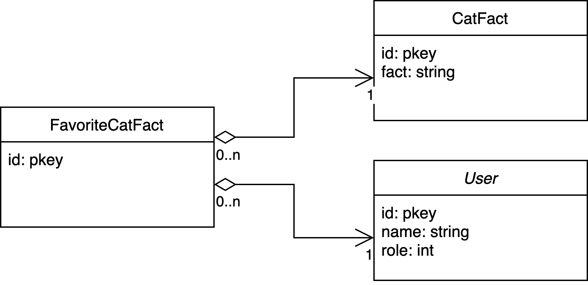

# ss_backend repo

## Steps to install locally

1. Make sure you have the ruby version specified in .ruby-version (2.7.7) if you use a ruby version manager like rvm execute `rvm install 2.7.7` or if you use rbenv use `rbenv install 2.7.7`
2. Clone the repository from github, then change directory to it:

```bash
git clone git@github.com:AlvaroEscalonaB/ss_backend.git
cd ss_backend
```

3. Then install the gems with `bundle` or `bundle install`
4. Once all gems are installed create a `.env` file in the root of the folder and set the next variables

```env
DB_USERNAME=postgres
DB_PASSWORD=postgres
SECRET_KEY_BASE=01b7dfacbc224a8f5bc1001563db557c31bc9303ed9958f06c535a9a284ab18bf60fb3199c0173d20ffc424521b3db6fe2ddf9f0c4a4398ee80273b86e228486
```

**Note**: You can generate a random key with `rake secret` in terminal

4. Create a `config/database.yml` file with the configuration of your postgresql database
5. Create the database with `rails db:create` then, `rails db:migrate`
6. Now ready to execute the app `rails s` in the terminal

## Docker compose

To run in developent mode in the docker compose is necessary to have the next folder structure with the same names for `ss_frontend` and `ss_backend` then

- `ss-app`
  - `css_frontend`
  - `css_backend`
- `docker-compose.yml` (Same level of ss-app)

The contents of the `docker-compose.yml` are the following:

```Dockerfile
version: '3.9'
services:
  db:
    image: postgres:13
    ports:
      - 5432:5432
    environment:
      - POSTGRES_USER=postgres
      - POSTGRES_PASSWORD=postgres
      - POSTGRES_DB=ss_backend_production
    networks:
      - app_network
  ss_frontend:
    build:
      context: ./ss_frontend
      dockerfile: Dockerfile
    ports:
      - 5173:5173
    depends_on:
      -  ssbackend
    environment:
      - VITE_BACK_API=http://0.0.0.0:3000/api/v1
    networks:
      - app_network
  ssbackend:
    build:
      context: ./ss_backend
      dockerfile: Dockerfile
    ports:
      - 3000:3000
    depends_on:
      - db
    environment:
      - RAILS_ENV=production
      - SECRET_KEY_BASE=279352f03eaab87b6930474e5392f15c13c4de80fbf079ed1c2c0541e64ae996c7aae45e451ea68c478952b199486ee476ea5156e404307eb26b26d7b53de66e
      - DB_USERNAME=postgres
      - DB_PASSWORD=postgres
      - DB_HOST=db
    networks:
      - app_network

networks:
  app_network:
```

To run effectively the migrations you should run the following command:

```
docker-compose run ssbackend rails db:migrate
```

Once this is effectively done,

## Development quality, highlights in my opinion

1. Serialize certain responses, although wasn't completely exhaustive through all the controllers, complex responses where serialized. This is specially good due that the frontend is in typescript, then the interfaces could be mapped easily
2. Adapt external libraries: For example is well known that adapt the common third party libraries to the project as plugins or concerns like the jwt gem or the httparty, this is one of the SOLID principles: The Liskov Substitution Principle.
3. Usage of jwt to have a extra layer of security
4. Test of models and requests

## To improve

1. Use the jwt-devise gem with a strategy to have and only one toker active for a particular user, also to have a better testing experience, althogh the jwt gem gives you more control.
2. Exhaustive testing and see the coverage report of all the application
3. Use a factory for testing to repeat less code

## UML


